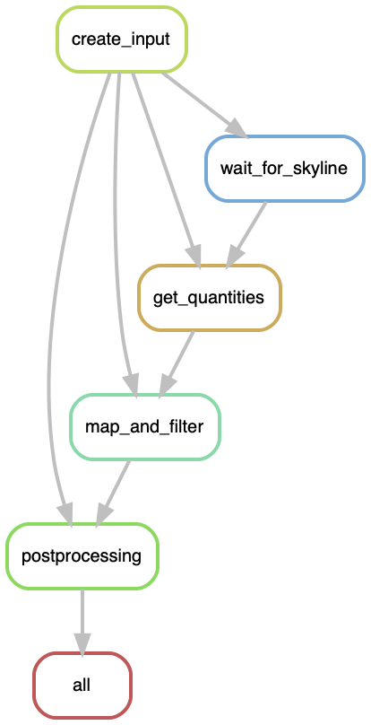
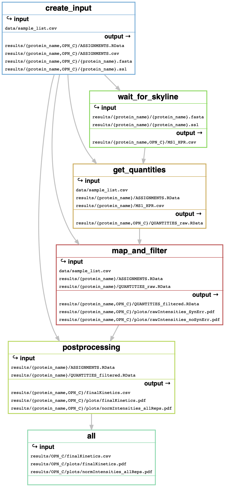

# aSPIRE
abundance of spliced peptides identified using relative quantification  


## overview and requirements
*aSPIre* provides the quantification of spliced and non-spliced peptides that were identified with *inSPIRE*. It does not do any heavy computing, thus can be run on a **Linux, Mac or Windows laptop** on a single CPU. (**Note**, that software testing was done only on macOS).
In order to run *aSPIre*, you furthermore need access to a Windows machine that has [Skyline](https://skyline.ms/project/home/software/Skyline/begin.view) installed. **Skyline** is a freely available tool for MS analysis.

*aSPIre* processes peptide-spectrum matches (PSMs) that were assigned by *inSPIRE*, quantifies them using Skyline and constructs a generation kinetic for each identified peptide.



**Note that *aSPIre* can be run on any device. Some intermediate steps have to be executed on a Windows machine using Skyline. During these steps, the pipeline is waiting until the Skyline output from the Windows machine is available on the device where you are running *aSPIre*.**  
*aSPIre* parses PSMs assigned by [*inSPIRE*](https://github.com/QuantSysBio/inSPIRE) or [*invitroSPI*](https://github.com/QuantSysBio/invitroSPI) and creates the input for MS1 quantification. The user then has to switch to the Windows machine and run Skyline following the instructions in `Skyline_tutorial.pdf`. Afterwards, quantification results are extracted and parsed. Quantified peptides are being mapped to the substrate sequence to determine the product type and synthesis errors are being removed. Finally, MS1 intensities are normalised and plotted and a final list of assigned and quantified peptides is being generated.

## sample list
The user must provide *inSPIRE* final assignments and features. All information must be provided in the sample_list.csv (see an example below). You can edit the sample list using, e.g., MS Excel. In any case, make sure to save it as file with comma-separated values (.csv) and NOT as .xlsx notebook! **To check that the sample list is in the correct format, you can open it using a text editor and verify that the columns are separated by commas (and NOT semicolons)**.

| protein_name | substrateID | substrateSeq | digestTime | biological_replicate | final_assignments | raw_file |
| ----- |  ----- |  ----- |  ----- |  ----- |  ----- |  ----- |
IL37b	| IL37b	| IL37b.fasta| 0 | 	G1	| IL37b_finalAssignments.csv | WSoh_101121_151121_HFGoe_G1_IL37b_0h_R1.raw
IL37b	| IL37b	| IL37b.fasta	| 4	| G1	| IL37b_finalAssignments.csv	| WSoh_101121_151121_HFGoe_G1_IL37b_4h_R1.raw
IL37b	| IL37b	| IL37b.fasta	| 0	| G2	| IL37b_finalAssignments.csv	| WSoh_101121_151121_HFGoe_G2_IL37b_0h_R1.raw
IL37b	| IL37b	| IL37b.fasta	| 2	| G2	| IL37b_finalAssignments.csv	| WSoh_101121_151121_HFGoe_G2_IL37b_2h_R2.raw

A few general remarks:
- Please always provide a full kinetic including the zero hours / no proteasome control measurements.
- You can put any number of proteins / experiments in the sample list. However, **only one a single can be processed at once**. Specify the protein_name you would like to analyse in `data/config.yaml` (see below).
- Do not put any white spaces, umlauts or empty rows in the sample list. Also, every column has to be filled, even if there are duplicated entries (*e.g.*, substrateID).

### protein_name and substrateID
`protein_name` is the name of the protein/polypeptide to which the respective list entry corresponds. Choose a short and comprehensive name and avoid spaces or special characters.
`substrateID` is the ID under which the given protein will appear in the final output. Can be identical to `protein_name` (recommended), but this does not have to be the case.

### substrateSeq
If you are processing proteins, save their sequence in a single-entry `.fasta` file and deploy it in `data/sequences/`. Specify the name of the `.fasta` file in the `substrateSeq` column of the sample list.

### digestTime
Time point after which the digestion was stopped. **Please provide the time in hours!** For instance, if the digestion time is 15 min, enter 0.25. **Do not put any units in this column!**
Zero-hours time points are treated as control measurements. Please enter *0* as time point for the control measurements.

### biological_replicate
Name of the biological (NOT technical!) replicate. In the final kinetics, the mean over all technical replicates is calculated, whereas biological replicates are displayed separately. Please have a look at the full sample list (`data/sample_list.csv`) for clarification.
Alternatively, instead of the replicate name, you can also put a number in this column. For readability hower, the actual replicate ID is recommended.

### final_assignments
You will need only one file from *inSPIRE* in order to run *aSPIre*: `finalAssignments.csv`. They have to be copied into `data/inSPIRE` and re-named according to the example in the sample list. Specify the name of the *inSPIRE* output files in this column. 

### raw_file
Provide the **full name** (including `.raw` suffix) of the `.raw` file for the respective sample. You do NOT have to copy the `.raw` files to your local device. Make sure that all `.raw` files are accessible to a Windows machine with a Skyline installation.


## config
Please have a look on `data/config.yaml`:
```
protein_name: IL37b
spAngle: 0.7
qVal: 0.01
RT: 150
skyline_report: MS1_HPR
```
Specify the protein_name for which you would like to obtain kinetics in the corresponding line.  
Cut-offs for spectral angles, q-values and retention time error should remain unchanged, unless there is a concrete reason to change them.

## execution
### general remarks on I/O
Please make sure to follow exactly the instructions given above. As an input, the user must have:
- inSPIRE final assignments in `data/inSPIRE`
- protein sequences in `data/sequences`
- Furthermore, you will need MS `.raw` files and access to a Windows machine that has [Skyline](https://skyline.ms/project/home/software/Skyline/begin.view) installed. **You do not need to copy the .raw files to your laptop where you are executing *aSPIre*!**

The output of *aSPIre* is:
- table of PSMs in `.ssl` format and list of unique identified peptides in `.fasta` format - this is the input for Skyline
- quantification results that can be found in the `results/protein_name` folder. They entail a list of assigned and quantified peptides (`finalKinetics.csv`) as well as plots showing the kinetics at intermediate and final processing steps (`plots/` subfolder)

### Snakemake and Conda
The following instructions need to be **executed oncy once to set up *aSPIre***. Once this is done, you can directly progress to the execution for any further runs. *aSPIre* relies on [Conda](https://docs.conda.io/en/latest/) and Snakemake.
In order to install Conda, click on this [link](https://docs.conda.io/en/latest/miniconda.html) and follow the installation guidelines for your respective operating system.  
After installing Conda, you need to install Snakemake. The Snakemake installation procedure is described [here](https://snakemake.readthedocs.io/en/stable/getting_started/installation.html).

Briefly, open the terminal on your computer and paste the following lines sequentially:  
`conda install -n base -c conda-forge mamba`  
`conda activate base`  
`mamba create -c conda-forge -c bioconda -n snakemake snakemake`  
Additionally, you might need to run `conda update conda`. We repeatedly faced some issues around Conda installations. Please refer to [this tutorial](https://pad.gwdg.de/s/7C3rWC3w2#) for troubleshooting your installation.

Download this repository as a .zip file (click on *Code* at the upper right corner of this repository --> Download ZIP), move the .zip file in the desired directory on your computer and unpack it.
Open the terminal in this directory and enter: `conda activate snakemake`.

### aSPIre execution
Make sure that you are in the correct directory of your terminal. After entering `pwd` into the terminal, it should display `./aSPIre` or `./aSPIre-main`.  

The pipeline can be executed by pasting `snakemake --use-conda --cores all -R create_input` into the terminal. The progress of the pipeline execution should appear in your terminal window. Additionally, all statements are saved in a log file (`results/protein_name/log.txt`).
In case you have installed an older version of Conda/Snakemake and encounter an error when executing the pipeline, try executing
`snakemake --use-conda --cores all -R create_input --conda-frontend conda`.

1. *aSPIre* parses PSMs assigned by *inSPIRE* and creates the input for MS1 quantification: `protein_name.ssl` and `protein_name.fasta`.
2. Copy the two tables **into the same folder as the `.raw` files**. Run Skyline following the instructions in `Skyline_tutorial`, export the results using the report `MS1_HPR.csv` and copy it into `results/protein_name`. The pipeline will wait until the required output is in the correct folder.
3. Wait until the rest of the pipeline finished. You can find the final kinetics in `results/protein_name/`

After your jobs finished, enter `conda deactivate` in order to terminate your Conda environment.

A detailed overview of the files generated at each individual step of *aSPIre* can be found here:


