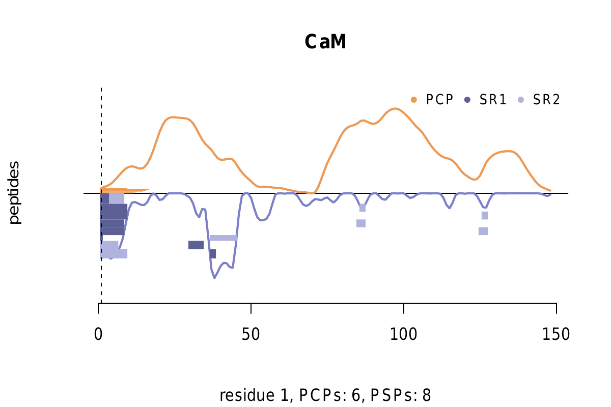
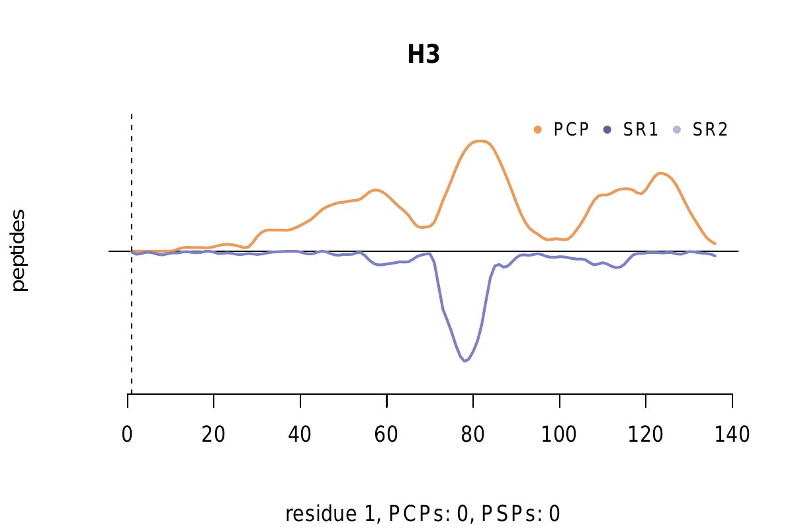

# aSPIRE
aSPIRE is a tool for the estimation of peptide abundances using label-free quantification mass spectrometry

List of contents:    
* [Overview and requirements](#Overview-and-requirements)
* [Installation of dependencies](#Installation-of-dependencies)
  - [Snakemake and Conda](#Snakemake-and-Conda)
  - [Skyline](#Skyline)
* [User input](#User-input)
  - [config file](#config-file)
  - [sample list](#sample-list)
* [Execution](#Execution)
* [Output](#Output)

## Overview and requirements
*aSPIRE* processes peptide-spectrum matches (PSMs) that were assigned by *inSPIRE*, quantifies them using [Skyline](https://skyline.ms/project/home/software/Skyline/begin.view) and constructs a generation kinetic for each identified peptide.
It can be run on a **Linux, Mac or Windows laptop or workstation**. However (**Note**, that software testing was done only on macOS/Linux).

The main steps of *aSPIRE* are:
- parsing of *inSPIRE* assignments (PSMs), peptide mapping and creation of input files for Skyline
- quantification of peptides across all raw files provided using Skyline (can be run either automatically by using a [Docker image](https://hub.docker.com/r/chambm/pwiz-skyline-i-agree-to-the-vendor-licenses) or manually on a Windows machine, see below for more details)
- aggregation of peptide abundances to generation kinetics
- removal of potential synthesis errors and contaminants
- data normalisation and filtering of noisy data points
- results visualisation (peptide generation kinetics, total ion chromatograms, peptide coverage maps, residue maps etc)

## Installation of dependencies
The following instructions need to be **executed oncy once to set up *aSPIRE***. Once this is done, you can directly progress to the [execution](#Execution) for any further runs.

### Snakemake and Conda
*aSPIRE* relies on [Conda](https://docs.conda.io/en/latest/) and Snakemake.
In order to install Conda, click on this [link](https://docs.conda.io/en/latest/miniconda.html) and follow the installation guidelines for your respective operating system.  
After installing Conda, you need to install Snakemake. The Snakemake installation procedure is described [here](https://snakemake.readthedocs.io/en/stable/getting_started/installation.html).

Briefly, open the terminal on your computer and paste the following lines sequentially:

    conda install -n base -c conda-forge conda
    conda activate base
    conda create -c conda-forge -c bioconda -n aspire snakemake

Additionally, you might need to run `conda update conda`. We repeatedly faced some issues around Conda installations, particularly with devices with Apple M1 cores. Please refer to [this tutorial](https://pad.gwdg.de/s/7C3rWC3w2#) for troubleshooting your installation.

Download this repository as a .zip file (click on *Code* at the upper right corner of this repository --> Download ZIP), move the .zip file in the desired directory on your computer and unpack it.
Open the terminal in this directory and enter:

    conda activate aspire

### Skyline
For the extraction of peptide abundances, *aSPIRE* relies on [Skyline](https://skyline.ms/project/home/software/Skyline/begin.view). There are two ways to execute *aSPIRE* and Skyline.
1. If you have limited experience with command line, a Windows machine available and only a few samples to process we recommend **manual execution**.
2. For high-throughput data processing with *aSPIRE* we recommend executing Skyline via **command line** in automated fashion.

Choose one of these methods according to your requirements and follow the respective instructions below.

#### Manual execution
Install Skyline on your Windows machine following the [vendor's instructions](https://skyline.ms/project/home/software/Skyline/begin.view). In the config file, remember to change the flag

    automatedSkyline: no

to `no` (see [config file](#config-file) section for detailed instructions). Make sure to follow the instructions in `Skyline_tutorial.pdf` during execution.

#### Command line execution
The command line options requires the installation of [Docker](https://www.docker.com/). Skyline is containerised in [this](https://hub.docker.com/r/chambm/pwiz-skyline-i-agree-to-the-vendor-licenses) Docker image. Pull the image and make sure that it works:

    docker pull chambm/pwiz-skyline-i-agree-to-the-vendor-licenses
    docker run -it --rm chambm/pwiz-skyline-i-agree-to-the-vendor-licenses wine SkylineCmd --help

You should see information for all possible flags printed. In the config file, remember to change the flag

    automatedSkyline: yes

to `yes` (see [config file](#config-file) section for detailed instructions).

## User input
All input information should be provided in the `data/` folder. Please have a look at the files `config.yaml` and `sample_list.csv` in that folder.

### config file
Open `data/config.yaml` using a text editor such as VS code or Sublime. Fill in the information as in the example:

    protein_name: CaM
    spAngle: 0
    qVal: 0.01
    RT: 150000000
    raw_file_loc: /absolute_path/to/folder_with_all_raw_files/
    automatedSkyline: yes
    skyline_report: MS1_HPR

| flag | explanation |
| ----- | ----- |
| `protein_name` | Name of the kinetic that should be analysed by *aSPIRE*. Must correspond to the `protein_name` column in the sample list (see [below](#sample-list)). |
| `spAngle` | Lower limit of spectral angles. Postfiltering of *inSPIRE* assignments is not recommended - do not change unless you have a reason to do so. |
| `qVal` | False discovery rate for which PSMs are filtered. Set to 1% per default. |
| `RT` | Upper limit of retention time error. Postfiltering of *inSPIRE* assignments is not recommended - do not change unless you have a reason to do so. |
| `raw_file_loc` | Absolute path pointing towards a folder that contains all raw files. This folder can also be located on a remote file server, however, the device from which you are running *aSPIRE* must have access to this folder. |
| `automatedSkyline` | Logical indicated whether Skyline should be executed manually or automatically via command line (see [above](#Skyline)). Enter `yes` or `no`. |
| `skyline_report` | Do not change. |

Special attention should be paid to `protein_name`, `raw_file_loc` and `automatedSkyline` flags. All other flags can be left to their default.
Make sure to save the config file after modifying it!

### sample list
Open `data/sample_list.csv` with MS Excel/Numbers etc or a text editor. Fill in the information as in the example:

| protein_name | substrateID | substrateSeq | digestTime | biological_replicate | final_assignments | raw_file |
| ----- |  ----- |  ----- |  ----- |  ----- |  ----- |  ----- |
CaM	| CaM	| CaM.fasta| 0 | 	b1	| CaM_psms.csv | HRoetschke_291222_040123_Fu_CaM_b1R1_0h.raw
CaM	| CaM	| CaM.fasta	| 1	| b1	| CaM_psms.csv	| HRoetschke_291222_040123_Fu_CaM_b1R1_1h.raw
CaM	| CaM	| CaM.fasta	| 2	| b1	| CaM_psms.csv	| HRoetschke_291222_040123_Fu_CaM_b1R1_2h.raw
CaM	| CaM	| CaM.fasta	| 4	| b1	| CaM_psms.csv	| HRoetschke_291222_040123_Fu_CaM_b1R1_4h.raw
CaM	| CaM	| CaM.fasta	| 4	| b2	| CaM_psms.csv	| HRoetschke_291222_040123_Fu_CaM_b2R1_4h.raw

A few general remarks:
- Please always provide a full kinetic including the zero hours / no proteasome control measurements.
- You can put any number of proteins / experiments in the sample list. However, **only a single protein can be processed at once**. Specify the `protein_name you` would like to analyse in the config file (see above).
- Do not put any white spaces, umlauts or empty rows in the sample list. Also, every column has to be filled, even if there are duplicated entries (*e.g.*, substrateID).

**Explanation of sample list columns:**
| column | explanation |
| ----- | ----- |
| `protein_name` | The name of the protein/polypeptide to which the respective list entry corresponds. Choose a short and comprehensive name and avoid spaces or special characters. |
| `substrateID` | ID under which the given protein will appear in the final output. Can be identical to `protein_name` (recommended), but this does not have to be the case. |
| `substrateSeq` | Save the substrate sequence in a single-entry `.fasta` file and deploy it in `data/sequences/`. Specify the name of the `.fasta` file in the `substrateSeq` column of the sample list. |
| `digestTime` | Time point after which the digestion was stopped. **Please provide the time in hours!** For instance, if the digestion time is 15 min, enter 0.25. **Do not put any units in this column!** Zero-hours time points are treated as control measurements. Please enter *0* as time point for all control measurements. |
| `biological_replicate` | Name of the biological (NOT technical!) replicate. In the final kinetics, the mean over all technical replicates is calculated, whereas biological replicates are displayed separately. Please have a look at the full sample list (`data/sample_list.csv`) for clarification. Alternatively, instead of the replicate name, you can also put a number in this column. For readability hower, the actual replicate ID is recommended. |
| `final_assignments` | PSM list from *inSPIRE* (**NOT peptide list!**). They have to be copied into `data/inSPIRE` and re-named according to the example in the sample list. Specify the name of the *inSPIRE* output files in this column. |
| `raw_file` | Provide the **full name** (including `.raw` suffix) of the `.raw` file for the respective sample. You do NOT have to copy the `.raw` files to your device. However, the device from which you are running *aSPIRE* must have access to this folder. |

After filling in all information, save the sample list in .csv format. **Important!** In case you are creating/editing the `sample_list.csv` file in Microsoft Excel, make sure to save it as actual comma-separated file. *I.e.*, Save as --> Comma-separated Values (.csv) To check that the sample list is in the correct format, you can open it using a text editor and verify that the columns are separated by commas (and NOT semicolons).

## Execution
Make sure you changed all input files and provided all necessary information. Open a terminal in the `aSPIRE` directory of your terminal. After entering `pwd` into the terminal, it should display `./aSPIRE` or `./aSPIRE-main`. Activate the conda environment (if not done so already) via: 

    conda activate aspire

Execute *aSPIRE* via:

    snakemake --use-conda --cores all

The progress of the execution should appear in your terminal window. Additionally, all statements are saved in a log file (`results/protein_name/log.txt`).
In case you have installed an older version of Conda/Snakemake and encounter an error when executing the tool, try executing

    snakemake --use-conda --cores all --conda-frontend conda

After your jobs finished, enter

    conda deactivate

in order to terminate your Conda environment.
All results are stored in the `results/protein_name/` folder.

## Output
*aSPIRE* produces a variety of tabular and graphic output, *e.g.*, a table with full the annotation of each detected and quantified peptide, graphics of generation kinetics for each peptide, total ion chromatograms, coverage and residue maps, among others. For each specified protein name, the following files can be found in results:

    .
    ├── ASSIGNMENTS.RData
    ├── ASSIGNMENTS.csv
    ├── protein_name.fasta
    ├── protein_name.ssl
    ├── protein_name_YYMMDD.sky
    ├── protein_name_TICs.tsv
    ├── protein_name_finalKinetics.csv
    ├── MS1_HPR.csv
    ├── QUANTITIES_filtered.RData
    ├── QUANTITIES_raw.RData
    ├── log.txt
    ├── notQuant.csv
    ├── plots
    │   ├── protein_name_TICs.done
    │   ├── protein_name_TICs.pdf
    │   ├── protein_name_coverage.pdf
    │   ├── protein_name_coveragevalues.RData
    │   ├── protein_name_finalKinetics.pdf
    │   ├── protein_name_rawIntensities.pdf
    │   ├── protein_name_residuemap.gif
    │   └── protein_name_residuemap.pdf
    └── skyline_log.txt

The relevant output files for the user are explained below.

| file name | explanation |
| ----- | ----- |
| `protein_name_finalKinetics.csv` | Table with full annotation of each identified and quantified peptide. Contaminants are labelled with *NA* in `substrateID` column. See [below](#finalKinetics) for detailed explanation of all columns. |
| `protein_name_finalKinetics.pdf` | Graphics of the generation kinetic for each peptide. Biological replicates are plotted as separate lines. Bars indicate SD between technical replicates. Substrate sequence origin coordinates as well as peptide sequence and product type are indicated. |
| `protein_name_YYMMDD.sky` | Skyline document. Can be opened in the Skyline GUI for direct access to chromatograms. |
| `protein_name_TICs.tsv` | Total ion chromatograms (TICs) for each raw file. |
| `protein_name_TICs.pdf` | Plots of TICs across 1) conditions or 2) replicates for QC. |
| `protein_name_coverage.pdf` | Coverage profiles with the abundance of spliced/non-spliced peptides over time. |
| `protein_name_residuemap.gif` | Visualisation of peptide origins and abundances. For each substrate residues, all peptides that contain this residue as potential origin are indicated. Bar height reflects relative abundance of a peptide. The height of each peptide stack is normalised to the coverage at this position. | 

**Example of residue maps:**    
 

### finalKinetics
`protein_name_finalKinetics.csv` is the main output file of *aSPIRE*. Please find an explanation of the file below:    

| column | explanation |
| ----- | ----- |
| `substrateID` | substrate ID specified by the user in `sample_list.csv`. |
| `pepSeq` | Peptide sequence. Each peptide sequence is reported *n*-times, where *n* is the number of biological replicates. |
| `biological_replicate` | Biological replicate to which the intensities correspond. |
| `digestTimes` | Digestion time points, separated by *;*. |
| `intensities` | MS1 intensities that correspond to the respective time points, separated by *;*. |
| `substrateSeq` | Amino acid sequence of the substrate. |
| `productType` | Peptide product type. `PCP`: non-spliced, `PSP`: spliced. |
| `spliceType` | Peptide splice type. `cis`: forward *cis*-spliced, `revCis`: reverse *cis*-spliced, `trans`: *trans*-spliced. Multiple possible product types are separated by *;* (`PCP` denotes non-spliced peptides). |
| `positions` | Coordinates of the substrate origin of each peptide. Multiple possible origins are separated by *;*. |
| `noScans` | Number of PSMs in which the peptide was identified. |
| `assignedScans` | PSMs in which the peptide was identified. Format: `raw-file-name_scan-number`. Multiple PSMs are separated by *;*. |
| `spectralAngles` | Spectral angles corresponding to the PSMs (separated by *;*). |
| `qValues` | q-values (FDRs) corresponding to the PSMs (separated by *;*). |
| `ionScores` | Search engine scores corresponding to the PSMs (separated by *;*). |
| `deltaRTs` | iRT errors corresponding to the PSMs (separated by *;*). |
| `charges` | Charges corresponding to the PSMs (separated by *;*). |
| `modifications` | Post-translational modifications (PTMs) corresponding to the PSMs (separated by *;*). |
